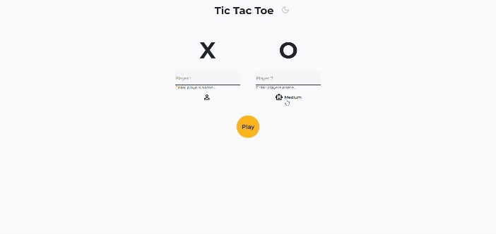
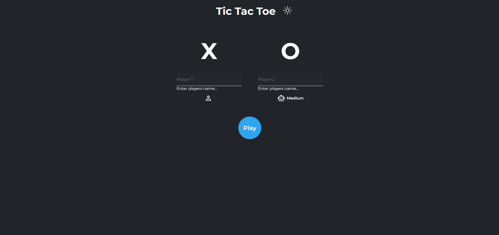
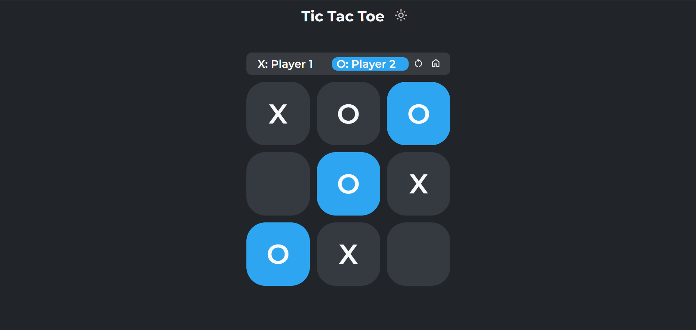

# tic-tac-toe
## Description
This project was completed as part of [The Odin Project](https://www.theodinproject.com/) in order to practice Javascript fundamentals on the module pattern and factory functions. The challenge was to have as little global variables as possible. I ended up having 3 modules total. One module was dedicated to the game itself, another managed the DOM and user input and the third module controlled the algorithm used against players. I also used a factory function to create instances of the players.

The game follows the standard Tic-tac-toe playing conventions (I think), and it gives players the option to play against a friend or the computer. There are also three difficulties when playing against the computer ranging from easy to hard. Lastly, I added the ability to observe the computer playing against itself which I think is interesting to watch. 

### Play Live Here: https://hpagon.github.io/tic-tac-toe/

## Credits
- Icons:
    - [Google Material Symbols](https://fonts.google.com/icons)
- Computer Algorithm Resources
    - [How to Win Tic-Tac-Toe: The Strategies You Need to Master](https://www.rd.com/article/how-to-win-tic-tac-toe/)
    - [Tic-Tac-Toe Strategy](https://blog.ostermiller.org/tic-tac-toe-strategy/)